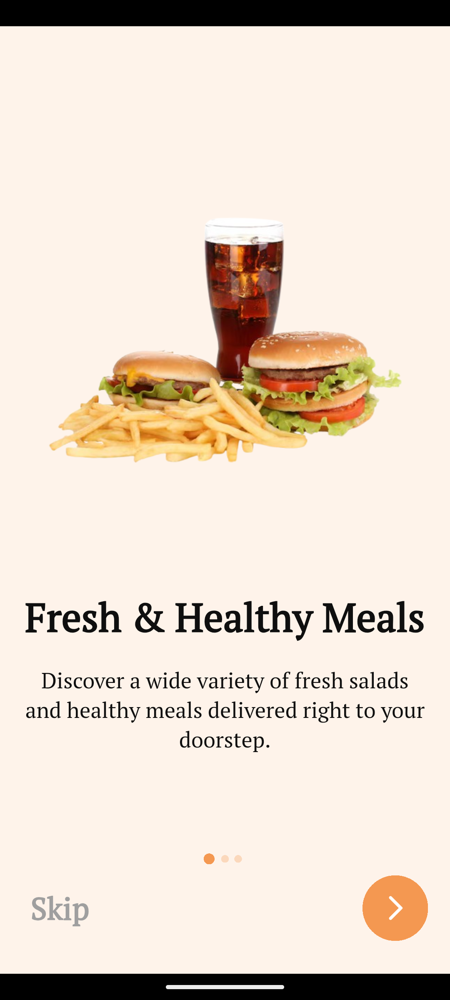
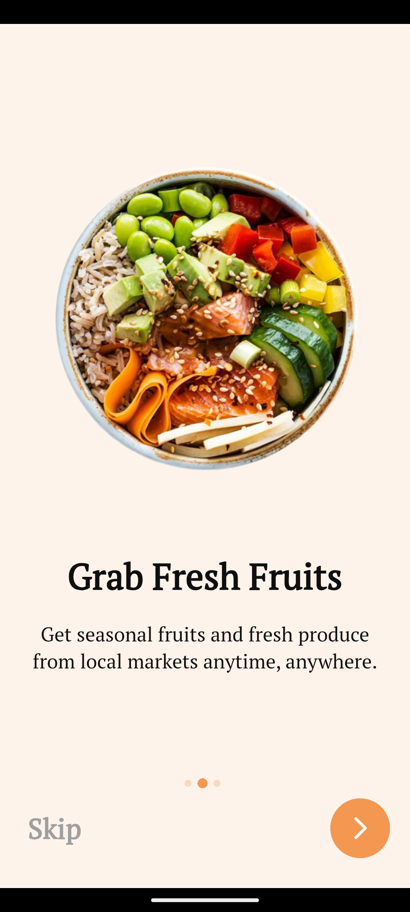
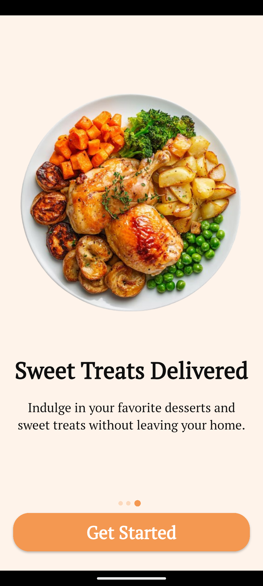
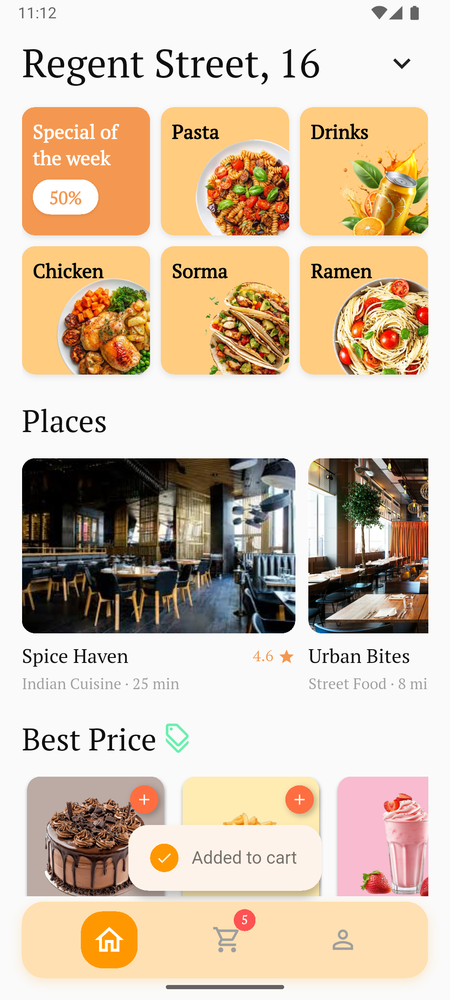
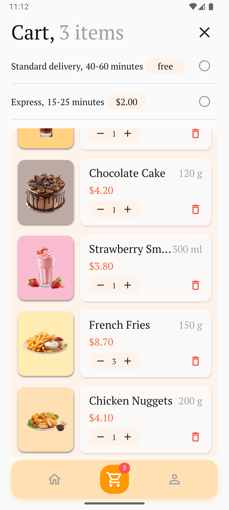
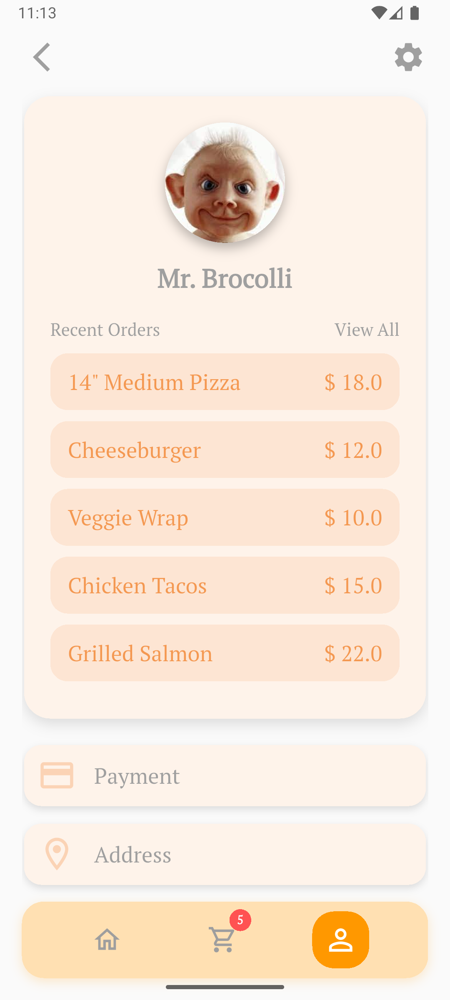

# Foodie – Modern Food Delivery UI

A sleek, minimal, and responsive **food delivery app UI** built with **Flutter**.  
Foodie offers a visually rich and smooth experience for browsing food items, managing the cart, and handling profiles — all wrapped in a modern layout.

---

## Features

- **Beautiful Home UI** – Clean grid-based layout with responsive design.
- **Onboarding Flow** – Interactive screens introducing the app.
- **Cart Management** – Minimal and intuitive cart screen.
- **Profile Section** – Simple user interface for account view.
- **Custom UI Components** – Built from scratch with reusable widgets and consistent color styling.

---

## Screenshots

### Onboarding
<p align="center">
  
  
  
</p>

### Home Screen
<p align="center">
  
</p>

### Cart Screen
<p align="center">
  
</p>

### Profile Screen
<p align="center">
  
</p>

---

## Installation

**Clone the repository**
   ```bash
   git clone https://github.com/yourusername/foodie.git
   cd foodie
